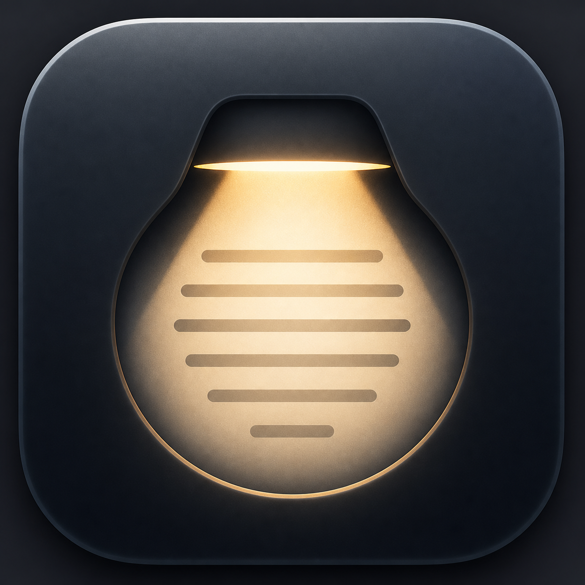

# LightoffReading

**言語:** [English](README.md) | [简体中文](README.zh-CN.md) | [日本語](README.ja.md)

<p align="center">
  
</p>

LightoffReading は、画面全体を暗くしながら、マウスカーソルの近くに柔らかい読書用スポットライトを残す、軽量な macOS メニューバーアプリです。

長いWebページ、PDF、ドキュメント、文字量の多い文章を読むときや、夜間や明るい環境での読書に向いています。メニューバーに常駐し、フローティング HUD から操作でき、グローバルショートカットでも読書ライトを切り替えられます。

macOS 13 以降が必要です。公開リリースは Apple Silicon と Intel Mac の両方に対応した universal macOS app です。

## インストール

### ターミナルで高速インストール

```sh
curl -fsSL https://raw.githubusercontent.com/andrewLi1994/LightoffReading/main/scripts/install-latest.sh | bash
```

このコマンドは最新リリースをダウンロードし、アプリを `/Applications` にコピーして起動します。

### 実験的な Codex Alpha

Codex 連携は実験的な開発者向けチャンネルです。安定版と同じ場所にインストールされます：

```text
/Applications/LightoffReading.app
```

alpha をインストールすると安定版が置き換えられます。安定版を再インストールすると alpha も置き換えられます。

```sh
curl -fsSL https://raw.githubusercontent.com/andrewLi1994/LightoffReading/experiment/codex-status-light/scripts/install-codex-alpha.sh | bash
```

alpha は Codex hooks を自動では有効にしません。LightoffReading のメニューバー項目から `Enable Codex Integration...` を選び、Codex で `/hooks` を実行して LightoffReading hooks を一度確認して信頼してください。

Codex ステータスライトは、青を作業中、黄をユーザーの注意が必要な状態、緑を完了ハイライトとして使います。黄色には、権限承認 hook と、`request_user_input` / `Awaiting response` のようにユーザーの選択や返信を待つ状態の両方が含まれます。権限承認は Codex hooks を主経路として使い、`request_user_input` は軽量なローカル session observer が現在アクティブな Codex JSONL session file だけを tail して検出します。ログ形式が変わった場合は静かに無効化されます。

ローカル receiver は任意の agent id も受け付けます。例：`/state/running?agent=a`。複数 agent の場合、どれか 1 つでもユーザーの注意を必要としていれば全体は黄色になります。そうでなければ、どれか 1 つでも running なら全体は青になります。ある agent が完了した場合は緑の done ハイライトを再生し、その後は現在の集約状態に戻ります。

メニューには、ローカル Codex receiver が `127.0.0.1:38561` で listening しているかも表示されます。`Send Test Status` サブメニューから、Terminal を開かずに `Running`、`Needs Attention`、`Done`、`Idle` を確認できます。

### ターミナルを使わずにインストール

1. 最新リリースを開きます：
   https://github.com/andrewLi1994/LightoffReading/releases/latest

2. `LightoffReading.zip` をダウンロードします。

3. 解凍して、`LightoffReading.app` を `/Applications` フォルダに移動します。

`/Applications` から LightoffReading を開きます。起動すると macOS のメニューバーに表示されます。

初回インストール後は、署名済みアップデートを自動的に確認してインストールします。メニューバーメニューの `Check for Updates...` から手動確認もできます。

初回起動時に macOS がアプリをブロックした場合は、システム設定を開き、「プライバシーとセキュリティ」から許可してください。

## 機能

- 画面を暗くしながら、柔らかい読書エリアを残します。
- 読書エリアはマウスカーソルの位置に追従します。
- 横長ストリップ、楕円、その他のスポットライト形状に対応します。
- コンパクトなフローティング HUD で、素早くオンオフや形状変更ができます。
- 展開 HUD で、幅、高さ、エッジの柔らかさ、暗さ、位置オフセットを調整できます。
- グローバルショートカットに対応し、初期設定は `Control-Option-Command-/` です。
- 設定は macOS の設定領域にローカル保存されます。

## プライバシー

LightoffReading には、分析、テレメトリ、アカウント、利用状況の送信は含まれていません。

アプリはショートカットと表示設定をあなたの Mac 上にローカル保存し、署名済みアップデートの確認とダウンロードのために GitHub Releases に接続します。

## 使い方

起動後、LightoffReading は macOS のメニューバーに表示されます。

- `Control-Option-Command-/` で読書ライトをオンオフします。
- フローティング HUD で読書ライトのオンオフや形状変更を行います。
- メニューバー項目の `Show Floating HUD` からコントロールを再表示できます。
- `Set Shortcut...` で別のショートカットを設定できます。

初回起動時には、メニューバーアイコンの下に短いヒントが一度だけ表示され、操作場所がわかるようになっています。

## サポート

LightoffReading はオープンソースです。役に立った場合は GitHub Sponsors から支援できます：

https://github.com/sponsors/andrewLi1994

## ビルド

```sh
bash scripts/build-app.sh
```

このスクリプトは次を作成します：

```text
.build/release/LightoffReading.app
```

デフォルトでは、app bundle には universal binary が含まれます。ローカルでより速くネイティブアーキテクチャのみをビルドする場合：

```sh
UNIVERSAL_BUILD=0 bash scripts/build-app.sh
```

バージョン管理：

- `APP_VERSION` 環境変数が設定されている場合は、それが優先されます。
- GitHub Actions の tag build では、`v1.2.3` が app version `1.2.3` になります。
- それ以外の場合、ビルドスクリプトはローカルの最新 `v*` git tag を使用します。
- バージョンを解決できない場合、適当な値を作るのではなくビルドを失敗させます。

## ローカルで実行

```sh
open .build/release/LightoffReading.app
```

## ソースからインストール

コントリビューター、またはローカルでビルドしたいユーザー向け：

```sh
git clone https://github.com/andrewLi1994/LightoffReading.git
cd LightoffReading
bash scripts/install.sh
```

このスクリプトは app をビルドし、`/Applications/LightoffReading.app` にコピーし、ローカルの quarantine metadata がある場合は削除してから起動します。

## リリースをパッケージする

リリースアセットを作成します：

```sh
bash scripts/package-release.sh
```

このスクリプトは次を作成します：

```text
dist/LightoffReading.zip
dist/LightoffReading.zip.sha256
```

`v*` tag を push すると、GitHub Actions が自動的に release asset をビルドして公開します。

```sh
git tag v0.1.0
git push origin v0.1.0
```

## 署名と Notarization

`scripts/build-app.sh` はローカル利用向けに ad-hoc signed app を作成します。Mac App Store 以外でよりスムーズな公開ダウンロード体験を提供するには、Developer ID で署名し、notarization 済みのリリースとしてパッケージすることを推奨します。

例：

```sh
BUNDLE_ID="com.yourname.LightoffReading" \
SIGN_IDENTITY="Developer ID Application: Your Name (TEAMID)" \
NOTARY_PROFILE="notarytool-profile-name" \
bash scripts/package-release.sh
```

Developer ID 署名と notarization がない場合、macOS Gatekeeper により、初回起動時にユーザーが手動で許可する必要があることがあります。

## ライセンス

LightoffReading は MIT License で公開されています。
